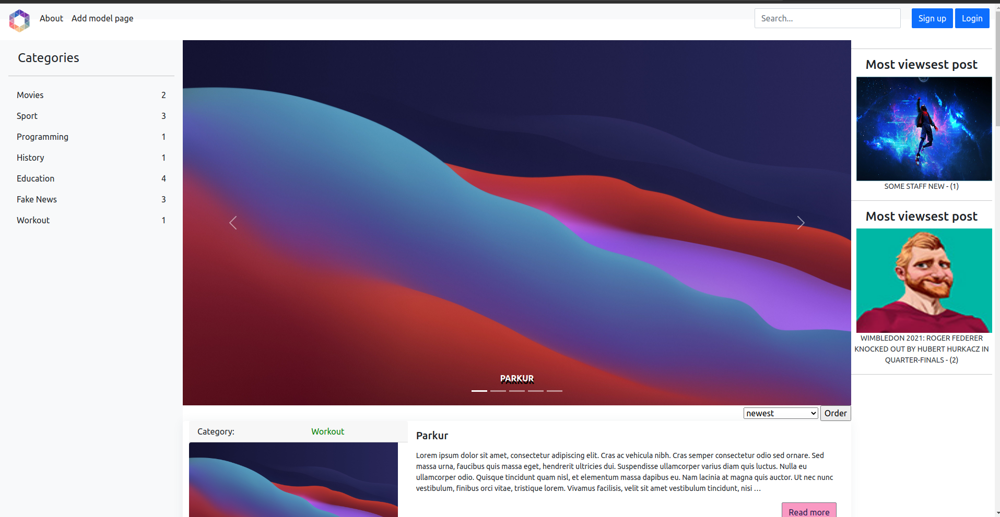
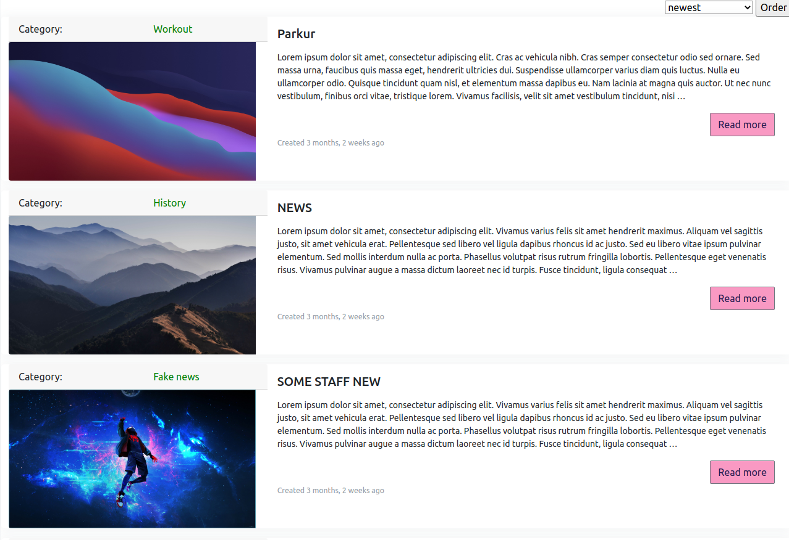
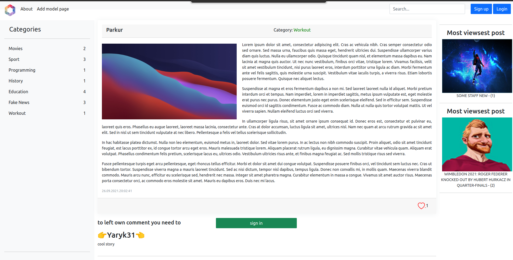
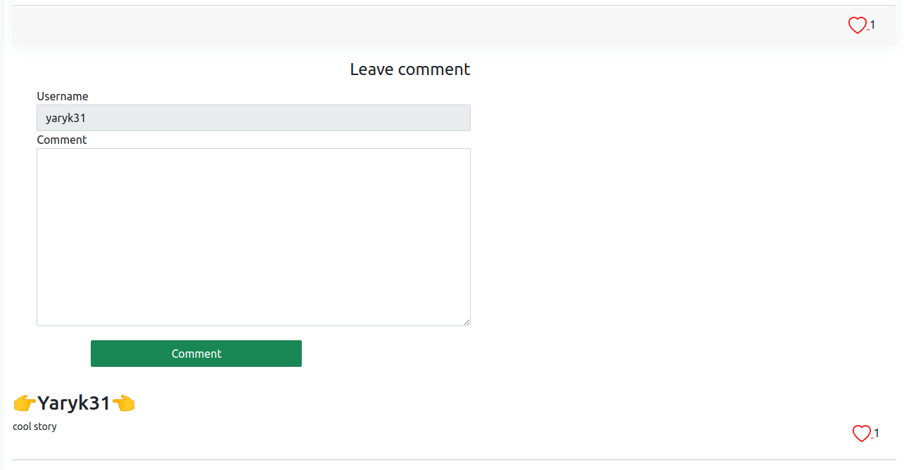
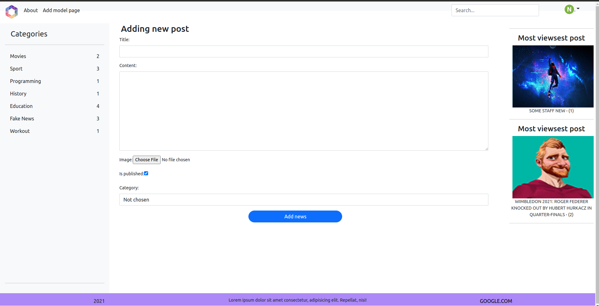

# Django Blog





Perfect application for seeing and posting blog with all features like ordering, search, 
likes, commtnts, like on comments, etc

To install this repo you need to do following steps:

Step 1
```sh
git clone https://github.com/YaroslavYaryk/DjangoProject.git
```
Step 2
You need to create virtual environment on your pc:
for Windows
```sh
> python -m venv [Virtual Environment Name]
Example,
> python -m venv sample_venv
```
for Linux/Mac
```sh
> python3 -m venv [Virtual Environment Name]
Example,
> python3 -m venv sample_venv
```

Step 3
You need to activate your virtual invironment virtual environment:
for Windows
```sh
> .\[Virtual Environment Folder Name]\Scripts\activate
Example,
> .\sample_venv\Scripts\activate
``` 
for Linux/Mac
```sh
> source [Virtual Environment Name]/bin/activate
Example,
> source sample_venv/bin/activate
``` 
Step 4
You need to install all project dependencies:
```sh
> pip install -r requirements.txt
``` 
Step 5
You need to create all database tables on your local machine:
```sh
> python manage.py migrate
``` 
Step 6
Finally start project:
```sh
> python manage.py runserver
``` 
